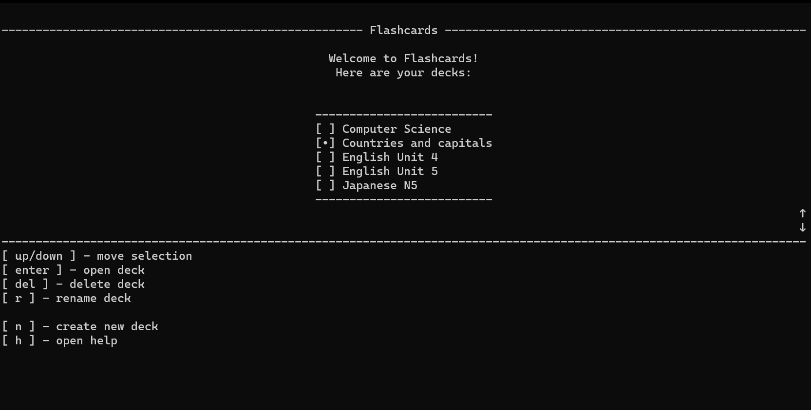
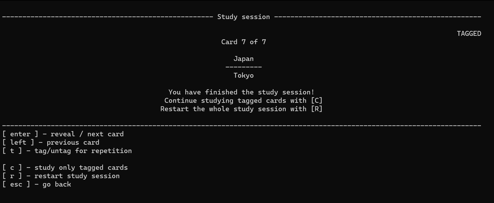
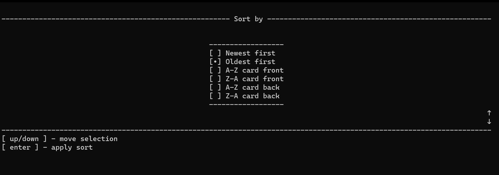
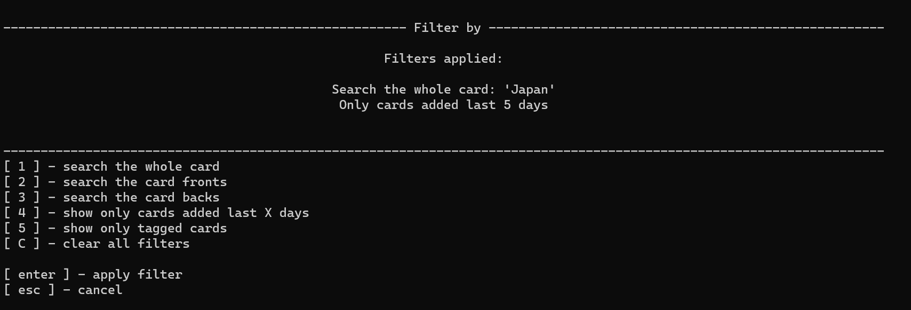

# Flashcards
**Flashcards** is a simple C# console app to help you studying using, well, flashcards. You can create, manage and study your flashcards all within one friendly command line interface. I made it as a personal project, due to the fact that I love C# lol.

## Features

### Current ###
- Friendly command line interface controlled with keyboard
- Grouping cards into decks
- Customized study sessions
- Embedded help menu
- Sorting and filtering cards
### Planned ###
- Import and export decks

## Installation ##
To simply install and use the app, go to the **Releases** section and install a compressed folder with the newest release. Unpack the zip. Inside, you can see a lot of libraries and an executable file (**Flashcards.exe** if you're on Windows), which you should run to use the app

There is no automatic installer yet. Just put the app folder in any location, and add a shortcut to the .exe file on desktop, if you want to have an easy access to the app.

The app is self-contained, so there should theoretically be no need to install any additional C# related libraries, but tell me if it doesn't work on your device.

**Please use [Windows Terminal]**(https://apps.microsoft.com/detail/9N0DX20HK701) for this app (or just set it as default terminal) if you want smooth console experience with no visible lags. This applies to pre-Windows 11 users, as Windows Terminal is not installed yet by default

### Linux note ###
There is a release build for Linux. It should work (permit execution and execute the Flashcards file), but I prefer to focus on the Windows version

## Screenshots ##
### Home screen ###

### Study session ###

### Sorting cards ###

### Filtering cards ###

## Building ##
This app was built using C# with [Microsoft .NET 7.0](https://dotnet.microsoft.com/en-us/download)

## Documentation ##
You can find app usage instructions in the help menu. The app is rather intuitive to use, just follow the on-screen messages and possible options

For code documentation, most of the folders are documented along with simple to understand C# code examples. Just browse the project folders to find an explanation

## Future updates ##
I can't guarantee there will be any big updates, but for sure you can suggest a feature or a bugfix in **Issues** section. I'll try to keep this project alive anyway, but I have plans for other projects as well.
